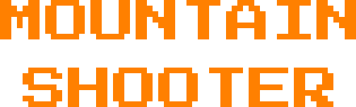
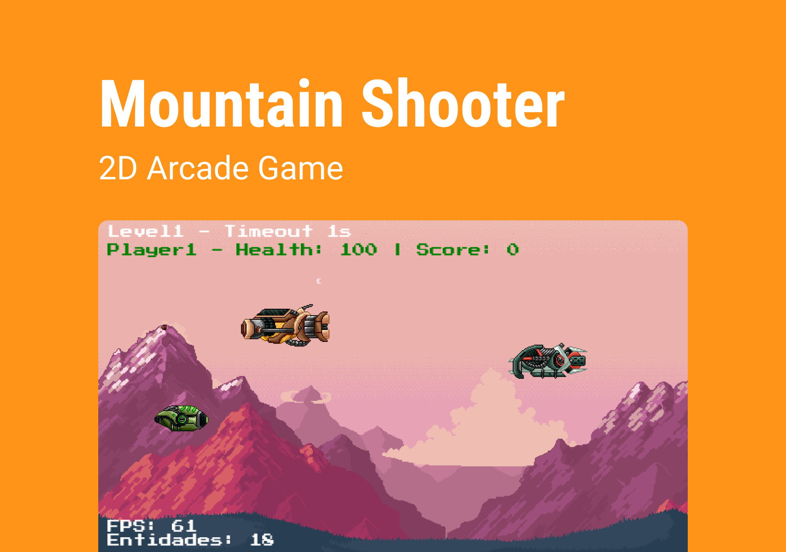
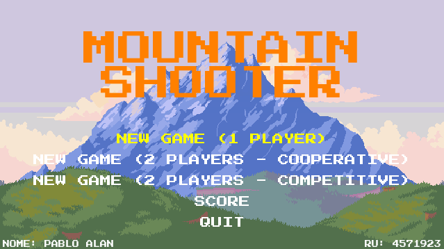
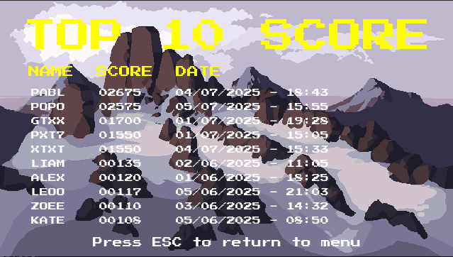
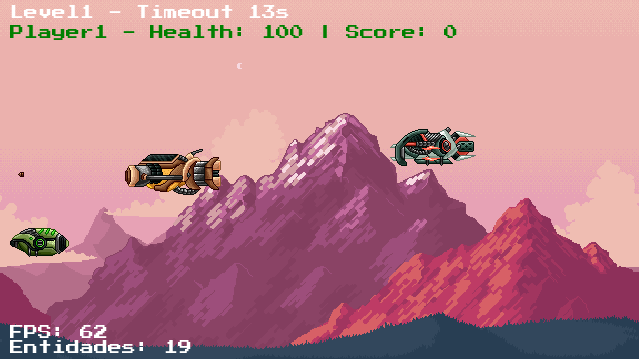
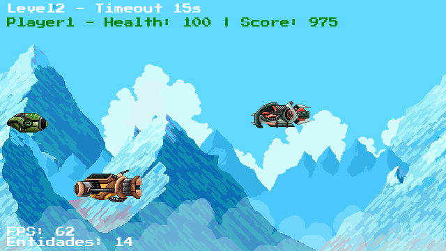
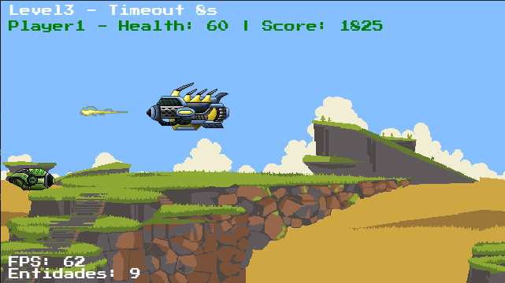
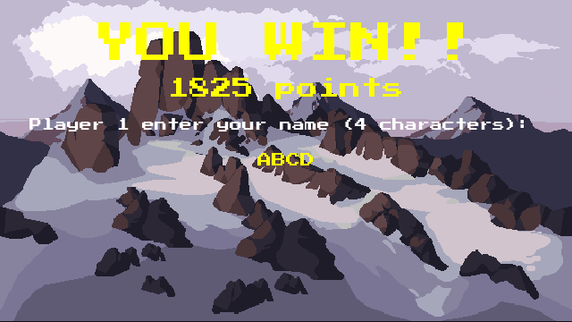
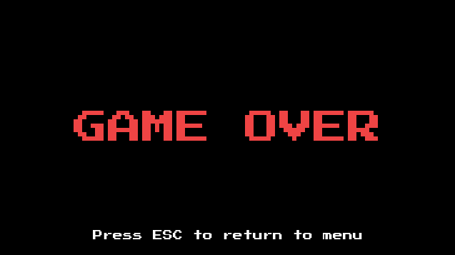

<h1 align="center">
  
</h1>

<p align="center">
  

  

  
  
  <a href="https://github.com/pabloxt14/MountainShooter/commits/master">
    
  </a>
    
   

   <a href="https://github.com/pabloxt14/MountainShooter/stargazers">
    
  </a>
</p>

<p>
  
</p>

<h4 align="center"> 
	🚀 Aplicação finalizada 🚀
</h4>

<p align="center">
 <a href="#-about">About</a> | 
 <a href="#-layout">Layout</a> | 
 <a href="#-setup">Setup</a> | 
 <a href="#-technologies">Technologies</a> | 
 <a href="#-license">License</a>
</p>


## 💻 About

O **MountainShooter** é um jogo arcade 2D de naves espaciais composto por 3 níveis com timeout (limite de tempo). O objetivo do jogador é sobreviver até o final de cada fase. O jogo pode ser jogado em modo single-player (um jogador) ou cooperativo (dois jogadores). Ao final, é possível salvar a pontuação alcançada.

Vale ressaltar, que este projeto foi desenvolvido como parte da atividade prática da disciplina de `Linguagem de Programação`, do curso de `Engenharia de Software` da universidade `UNINTER`.

Principais conceitos aplicados:
- Utilização da biblioteca de criação de jogos `pygame`;
- Aplicação dos princípios de Programação Orientada a Objetos (`POO`);
- Implementação de `Design Patterns` úteis no desenvolvimento de software, como `Factory`, `Mediator` e `Proxy`.

Controles do jogo:

**Player 1**:
- Movimentar: `↑`, `↓`, `←`, `→`
- Atirar: `Right Ctrl`

**Player 2**:
- Movimentar: `W`, `A`, `S`, `D`
- Atirar: `Left Ctrl`

<!-- ## 🔗 Deploy

O deploy da aplicação pode ser acessada através da seguinte URL base: https://pabloxt14-nlw-expert-notes.vercel.app/ -->


## 🎨 Layout

A seguir, veja uma demonstração das principais telas da aplicação:

### Menu

<p align="center">
  
</p>

### Score (Top 10 Players)

<p align="center">
  
</p>

### Level 1

<p align="center">
  
</p>

### Level 2

<p align="center">
  
</p>

### Level 3

<p align="center">
  
</p>

### Score (Save Player Name)

<p align="center">
  
</p>

### Game Over

<p align="center">
  
</p>


## ⚙ Setup

### 📝 Requisites

Antes de baixar o projeto você vai precisar ter instalado na sua máquina as seguintes ferramentas:

* [Git](https://git-scm.com)
* [Python](https://www.python.org/)

Além disto é bom ter um editor para trabalhar com o código como [VSCode](https://code.visualstudio.com/)

### Cloning and Running

Passo a passo para clonar e executar a aplicação na sua máquina:

```bash
# Clone este repositório
$ git clone git@github.com:pabloxt14/MountainShooter.git

# Acesse a pasta do projeto no terminal
$ cd MountainShooter/mobile

# Instale as dependências
$ pip install

# Execute a aplicação em modo de desenvolvimento
$ python main.py
```


## 🛠 Technologies

As seguintes principais ferramentas foram usadas na construção do projeto:

- **[Python](https://www.python.org/)**
- **[Pygame](https://www.pygame.org/)**
- **[SQLite](https://www.sqlite.org/)**

> Para mais detalhes das dependências gerais da aplicação veja o arquivo [requirements.txt](./requirements.txt)


## 📝 License

Este projeto está sob a licença MIT. Consulte o arquivo [LICENSE](./LICENSE) para mais informações

<p align="center">
  Feito com 💜 por Pablo Alan 👋🏽 <a href="https://www.linkedin.com/in/pabloalan/" target="_blank">Entre em contato!</a>  
</p>